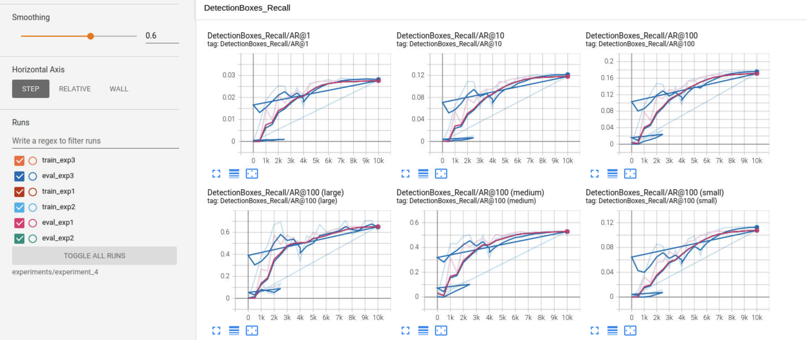

# Object Detection in an Urban Environment

## Project overview

This repo is a demostration to the course Computer Vision - a course of the Nanodegree program Self Driving Car Engineer.
|  Demo 1 | Demo 2     | 
| -------------- | -------------- | 
|   | |
## Data

For this project, the data from the [Waymo Open dataset](https://waymo.com/open/) is being used.

[OPTIONAL] - For offline usage of the data, the files can be downloaded directly from the website as tar files or from the [Google Cloud Bucket](https://console.cloud.google.com/storage/browser/waymo_open_dataset_v_1_2_0_individual_files/) as individual tf records.

## Structure

### Data

The data for training, validation and testing is organized as follow:

```
/home/workspace/data/waymo
	- training_and_validation - contains 97 files to train and validate your models
    - train: contain the train data (empty to start)
    - val: contain the val data (empty to start)
    - test - contains 3 files to test your model and create inference videos
```

### Experiments

The experiments folder will be organized as follow:

```
experiments/
    - pretrained_model/
    - exporter_main_v2.py - to create an inference model
    - model_main_tf2.py - to launch training
    - reference/ - reference training with the unchanged config file
    - experiment_0/ - experiment #0
    - experiment_2/ - experiment #2
    - label_map.pbtxt
    ...
```
## Setup

### Local Setup

For local setup, if an Nvidia GPU is available, please use the provided Dockerfile and requirements in the [build directory](./build).

Follow [the README therein](./build/README.md) to create a docker container and install all prerequisites.

### Download and process the data

In the scope of this project, I used the workspace provided by the course, where an NVIDIA GPU is available. The data was also provided in the workspace.

However, to prepare the data for the project, please follow the following steps.

The first goal of this project is to download the data from the Waymo's Google Cloud bucket to your local machine. For this project, we only need a subset of the data provided (for example, we do not need to use the Lidar data). Therefore, we are going to download and trim immediately each file. In `download_process.py`, you can view the `create_tf_example` function, which will perform this processing. This function takes the components of a Waymo Tf record and saves them in the Tf Object Detection api format. An example of such function is described [here](https://tensorflow-object-detection-api-tutorial.readthedocs.io/en/latest/training.html#create-tensorflow-records). We are already providing the `label_map.pbtxt` file.

You can run the script using the following command:

```
python download_process.py --data_dir {processed_file_location} --size {number of files you want to download}
```

You are downloading 100 files (unless you changed the `size` parameter) so be patient! Once the script is done, you can look inside your `data_dir` folder to see if the files have been downloaded and processed correctly.

## The dataset

### Exploratory Data Analysis

#### Qualitative

The above images are some samples from the dataset used in this project.

|  |  | |
| -------------- | -------------- | --- |
 |  |  |  |

To have a bigger dataset for training, some augmentations were made and some samples are shown as below:
  |   |    |  |
| -------------- | -------------- |------- |
|  |  |  |
#### Quantitative

Amongst all images in the dataset, 30000 samples were taken out for an analysis:


As it can be seen, there are 3 classes of the objects that the network will be trained on to detect. The are 542662 objects of type car, 164562 objects of type pedestrians and 4223 objects of type cyclists.

### Create the training - validation splits

The dataset was split into 3 parts:

- Train set: 86%
- Validation set: 10%
- Test set: 4%

Use the following command to run the script once your function is implemented:

```
python create_splits.py --data-dir /home/workspace/data
```

### Config file

Now, training can be started. The config that is used for this project is `pipeline.config`, which is the config for a SSD Resnet 50 640x640 model.

More information about the Single Shot Detector [here](https://arxiv.org/pdf/1512.02325.pdf).

First, let's download the [pretrained model](http://download.tensorflow.org/models/object_detection/tf2/20200711/ssd_resnet50_v1_fpn_640x640_coco17_tpu-8.tar.gz) and move it to `/home/workspace/experiments/pretrained_model/`.

The config files need to be edited and saved in the location of the training and validation files, as well as the location of the label_map file, pretrained weights. We also need to adjust the batch size. To do so, run the following:

```bash
python edit_config.py --train_dir /home/workspace/data/train/ --eval_dir /home/workspace/data/val/ --batch_size 2 --checkpoint /home/workspace/experiments/pretrained_model/ssd_resnet50_v1_fpn_640x640_coco17_tpu-8/checkpoint/ckpt-0 --label_map /home/workspace/experiments/label_map.pbtxt
```

A new config file has been created, `pipeline_new.config`. For different experiments, please duplicate this file in a separate folder.

### Training

To train the neural network, please run the following commands:

* For training process:

```bash
python experiments/model_main_tf2.py --model_dir=experiments/reference/ --pipeline_config_path=experiments/reference/pipeline_new.config
```

Once the training is finished, launch the evaluation process:

* For evaluation process:

```bash
python experiments/model_main_tf2.py --model_dir=experiments/reference/ --pipeline_config_path=experiments/reference/pipeline_new.config --checkpoint_dir=experiments/reference/
```

**Note**: Both processes will display some Tensorflow warnings, which can be ignored.

To monitor the training, you can launch a tensorboard instance by running `python -m tensorboard.main --logdir experiments/reference/`. You will report your findings in the writeup.

### Reference Experiments
There are 2 experiments carried out:

- The first experiment used the default configuration and was trained for 6 steps only. (pipline_0.config)
- The second experiment was using the same configuration from 1st experiment but with longer iterations. (pipeline_2.config)
- The third experiment was using the same configure from 2nd experiment but with many more augmentations samples. (pipeline_4.config)

|  1st experiment | 2nd experiment     | 3rd experiment| 
| -------------- | -------------- | ------|
|  |  | |

Training statistics for 1st experiment:
|   |    |  |
| -------------- | -------------- |------- |
|  |  |


Training statistics for 2nd experiment:
|   |    |  |
| -------------- | -------------- |------- |
|  |  |

Training statistics for 3rd experiment:
|   |    |  |
| -------------- | -------------- |------- |
|  |  |

Training statistics from 3 experiments altogether:
|   |    |  |
| -------------- | -------------- |------- |


### Improve on the reference

There are some moodifications made from 1st experiment to 2nd experiment.
The "->" illustrates the change of parameters from one 1st experiment to 2nd experiment.
The following parameters were modified:
  ``Augmentation by horizontal flip: default probabilty -> 0.1 ``
  ```
  optimizer {
  momentum_optimizer {
    learning_rate {
      cosine_decay_learning_rate {
        learning_rate_base: 0.04 -> 0.004499
        total_steps: 2500 -> 10000
        warmup_learning_rate: 0.013333
        warmup_steps: 200
      }
    }
    momentum_optimizer_value: 0.9 -> 0.0899
  }
  use_moving_average: false
  }
  ```

  ```
  num_steps: 2500 -> 10000
  ```

There are some moodifications made from 2nd experiment to 3rd experiment.
These changes involve various data augmentations:
  
  ```
  data_augmentation_options { 
    random_horizontal_flip { 
      keypoint_flip_permutation: 1 
      keypoint_flip_permutation: 0 
      keypoint_flip_permutation: 2 
      keypoint_flip_permutation: 3 
      keypoint_flip_permutation: 5 
      keypoint_flip_permutation: 4 
      probability: 0.5 
    } 
  } 
  data_augmentation_options { 
    random_rotation90 { 
        keypoint_rot_permutation: 3 
        keypoint_rot_permutation: 0 
        keypoint_rot_permutation: 1 
        keypoint_rot_permutation: 2 
        probability: 0.1 
    } 
  } 
  data_augmentation_options { 
    random_black_patches { 
        max_black_patches: 10 
        probability: 0.50 
        size_to_image_ratio: 0.12 
    } 
  } 
  data_augmentation_options { 
    random_adjust_brightness { 
        max_delta: 0.2 
    } 
  } 
  data_augmentation_options { 
    random_adjust_contrast { 
        min_delta: 0.7 max_delta: 1.1 
    } 
  } 
  data_augmentation_options { 
    random_adjust_hue { 
        max_delta: 0.01 
    } 
  } 
  data_augmentation_options { 
    random_adjust_saturation { 
        min_delta: 0.75 max_delta: 1.15 
    } 
  } 
  data_augmentation_options { 
    random_distort_color { 
        color_ordering: 1 
     } 
  }
  ```
  

### Future Work
- The model used in this project is based on the ResNet architecture. It's also interesting to investigate other detection architectures.

- The project is targeted at detecting only 3 objects (traffic participants). There is possibility to extend the detector to detect more objects rather than just 3.